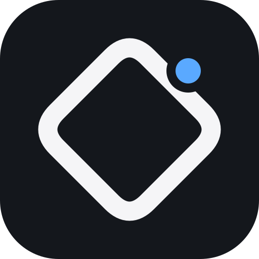
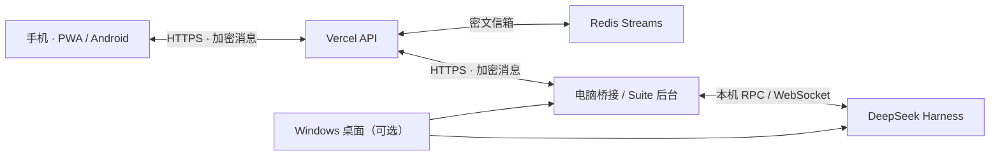

<div align="center">
  
  <h1>DSH Remote</h1>
  <p><strong>让电脑上的 DeepSeek Harness，延伸到你的手机。</strong></p>
  <p>远程对话 · 离线补收 · 端到端加密 · 桌面用量 · 可选浏览器工作台</p>
  <p>
    <a href="#快速开始">快速开始</a> ·
    <a href="#安装各端">安装各端</a> ·
    <a href="docs/deployment-vercel.md">部署文档</a> ·
    <a href="docs/security.md">安全边界</a> ·
    <a href="docs/CHANGELOG.md">更新说明</a>
  </p>
  <p><code>0.8.1 · early release</code> <code>Node.js ≥ 24.5</code> <code>Windows / WSL / Android / Web</code></p>
</div>

---

## 这是什么

**DSH Remote** 是 DeepSeek Harness（DSH）的独立配套项目。你可以在手机上继续电脑里的对话、查看任务结果、处理审批，或在任务运行中发送干预消息。

手机不需要一直开着：重新打开后，会补收仍在保留范围内的消息。从 0.8 开始，远程互联、Windows 桌面壳、Linux 用量组件与可选 NovaTab 被整理为 **DSH Suite**：同一个源码仓库，可按需选择不同入口。

> 这不是 DeepSeek 官方产品，也不是官方插件 SDK。**DSH 本体不在本仓库中**，需要自行安装和登录。项目不提供默认公共中继；网址、配对码与机器路径属于你自己的部署配置。

### 适合什么场景

- 电脑在做任务，你希望离开电脑后用手机查看和跟进。
- 手机无需后台常驻，但重新打开后需要看到电脑返回的结果。
- 你希望自行部署中继，保留对配置、密钥和运行方式的控制。

它不是云端托管的 DSH、远程桌面或多人注册平台。电脑处理任务时，DSH 和桥接后台必须运行；电脑关机后，中继不能替它执行任务。

## 功能一览

| 模块 | 已实现 |
| --- | --- |
| 远程对话 | 会话搜索、切换、新建，历史摘要、队列、模型和状态查看 |
| 任务控制 | 普通消息、steer 干预、停止回合，审批及提问的远程处理 |
| 消息同步 | 加密信箱、分页游标、断网重试、持久化发送队列、有限去重 |
| 移动界面 | 自定义会话面板、长标题省略、安全 Markdown、代码复制、轻量动画、统一波浪图标、软键盘自适应输入栏 |
| 连接状态 | 分别检查云端可达、电脑响应和 DSH 就绪 |
| 用量面板 | 余额、官方峰谷时段（工作日 9:00–12:00 / 14:00–18:00 高峰，其余空闲）、Tokens、估算费用与采样时间 |
| Windows 桌面 | WebView2 主窗口、无缝启动过渡、统一后台启停、配对入口、用量浮层 |
| NovaTab（可选） | 壁纸、搜索、书签、快捷链接、待办及本机保存的 DSH 入口 |

用量默认统计**电脑最近活跃会话**，不一定是手机当前选择的会话。费用是估算，以实际账单为准。NovaTab 不会自动把书签、历史或待办上传到中继。

## 工作方式



云端使用短 HTTP 请求与 Redis Streams，不要求手机维持云端长连接。Windows 桌面可以启动 Suite；已有自己的 DSH 启动方式时，也可以只运行桥接。

### 数据放在哪里

| 位置 | 保存的内容 |
| --- | --- |
| 电脑 | DSH 数据、私有配置、配对密钥、游标与发送队列 |
| 手机 / 浏览器 | 该客户端自己的配对信息、有限消息缓存与发送队列 |
| Vercel / Redis | 鉴权所需配置、密文消息，以及时间、长度等元数据 |

端到端加密保护的是消息传输与中继存储。仍需信任所安装的 APK、网页代码和自己的设备；它不能防止恶意客户端代码读取已解密内容。

## 快速开始

以 **Linux / WSL + 自部署 Vercel + 手机网页** 为最小路径。Windows 桌面和 Android APK 都是可选入口。

### 1. 准备环境

| 用途 | 前置条件 |
| --- | --- |
| 本地后台 | Node.js 24.5+；已安装、登录并能正常使用的 DSH |
| 云端信箱 | 自己的 Vercel 项目、Upstash Redis |
| 手机 | 能访问自己部署网址的现代浏览器 |
| 可选用量 | Bash、Python 3 / PyYAML、curl、GCC、libzstd |

已测试上游版本为 `@deepseek-ai/dsh@0.1.1-rc.2`。上游 API、日志格式或模型定价变化后，适配器可能需要更新；不承诺兼容所有版本。

### 2. 获取并检查源码

```bash
git clone https://github.com/PoesisQ/DSH-Remote.git
cd DSH-Remote
node --version
npm run build:pwa
npm run check
```

套件后台和桥接本体没有运行时 npm 依赖。Vercel 与 NovaTab 的依赖分别位于各自子目录。

### 3. 生成自己的配对配置

先创建或选择自己的 Vercel 项目，确定其正式域名，再运行：

```bash
node bin/dsh-remote.js \
  --config ./config.json \
  --relay-url https://YOUR-PROJECT.vercel.app \
  --init
```

替换示例域名。命令会生成本机私有配置，显示手机使用的 **DR2 配对码**，以及 Vercel 使用的信道与鉴权哈希。

**DR2 等同于远程控制权限。不要把完整输出或二维码截图放进公开仓库。** 普通启动不会打印 DR2；需要时可主动查看：

```bash
node bin/dsh-remote.js --config ./config.json --show-pairing
node bin/dsh-remote.js --config ./config.json --show-vercel-env
```

### 4. 部署 Vercel 信箱

在 Vercel 导入本仓库，将 **Root Directory 设为 `vercel`**，连接自己的 Redis，并配置：

| 环境变量 | 内容 |
| --- | --- |
| `UPSTASH_REDIS_REST_URL` | Redis REST 地址 |
| `UPSTASH_REDIS_REST_TOKEN` | Redis REST Token |
| `DSH_RELAY_CHANNEL` | 本机初始化输出的信道 |
| `DSH_RELAY_AUTH_SHA256` | 本机初始化输出的 Bearer 哈希 |
| `DSH_ALLOWED_ORIGINS` | 可信网页来源；使用 APK 时包含 Android 来源 |

Android 来源为 `https://appassets.androidplatform.net`。不要把完整 DR2、Bearer 原文或端到端密钥写进 Vercel 环境变量。

部署后的 `/api/health` 只检查云端存储，**不代表电脑已连接**。完整步骤、CORS、Preview 隔离与回滚见 [Vercel 部署指南](docs/deployment-vercel.md)。

### 5. 启动电脑端

#### 方式 A · 统一套件后台

希望统一管理 DSH、互联和用量时：

```bash
# 用量可选；需要前述系统依赖
bash desktop/linux/setup.sh

node bin/dsh-suite.js init \
  --workspace "$PWD" \
  --remote-config "$PWD/config.json"

node bin/dsh-suite.js doctor
node bin/dsh-suite.js run
```

`--workspace` 是希望 DSH 使用的目录，可换成其他绝对路径。默认 Suite 配置位于 `~/.config/dsh-suite/config.json`，支持 XDG 与自定义 profile。不使用用量组件时，可跳过 setup，并将私有 profile 的 `usageScript` 设为 `null`。

#### 方式 B · 只运行远程桥接

如果你已经运行 DSH Web，默认地址是 `http://127.0.0.1:3080`：

```bash
node bin/dsh-remote.js --config ./config.json
```

不要让两种方式同时使用同一份远程配置，否则可能重复处理命令。配置详情、启停命令与旧版迁移见 [套件指南](docs/suite.md)。

### 6. 用手机连接

1. 打开自己的 `https://YOUR-PROJECT.vercel.app/`。
2. 粘贴 DR2，点击“验证并连接”。
3. 等待电脑在线探测，再选择会话、发送消息。
4. 可将网页添加到主屏幕，或安装自己构建的 Android APK。

PWA 和 APK 有各自的本地存储，需要分别配对。同一电脑的 DR2 可以用于这两个入口；**不要把同一 DR2 分给多台执行桥接的电脑**。

## 安装各端

### Windows 桌面

Windows 桌面使用 **WinForms + WebView2**，后台运行在 WSL。构建需要 .NET Framework 编译器及 WebView2 SDK；运行需要 WebView2 Runtime。

```powershell
.\desktop\windows\Build.ps1 -SdkPath 'D:\sdk\webview2'
```

构建完成后，进入 `dist/desktop`：

```powershell
.\Install.ps1 -BackendRoot '/absolute/path/DSH-Remote' -Distro 'Ubuntu' -CreateShortcut
```

BackendRoot 必须是自己的 Linux 源码目录。首次运行前先完成 Linux profile 初始化；**不要同时手动运行 Suite，再让桌面重复启动同一个 profile**。

桌面配置保存在安装目录旁的 `desktop.settings.json`。关闭桌面默认停止本套件自己启动的后台；复用的外部 DSH 不会被按端口强行终止。安装脚本拒绝覆盖已有安装，升级前请备份并阅读 [迁移说明](docs/suite.md)。

### Android APK

准备 Java 17、Android SDK 35、Gradle 8.7，然后在 Linux / WSL 运行：

```bash
bash scripts/build-apk.sh
```

产物：`dist/DSH-Remote-v0.8.1.apk`。工具链路径通过标准环境变量或私有 `.runtime.env` 配置；依赖已全部缓存时可启用 `DSH_REMOTE_GRADLE_OFFLINE=1`。

当前脚本生成 **debug 签名测试包**。同签名可覆盖升级；不同签名不能直接覆盖，不要为了安装而先删除旧 App 数据。APK 内置页面需要安装新版才能更新，不能只刷新网站。

### NovaTab（可选）

```bash
cd modules/novatab
npm ci
npm run compile
npm run build
```

在 Chrome / Edge 扩展管理页，以开发者模式载入 `.output/chrome-mv3`。已有用户先导出备份；扩展 ID 或载入路径变化可能对应新的存储区。

右下角 **DSH / ···** 可设置自己的网页或本机 DSH 地址。不填写 DR2，不自动把浏览器数据同步到云端。

## 配置与日常使用

### 私有配置的边界

| 配置 | 用途 | 是否提交 |
| --- | --- | --- |
| `config.json` | 中继网址、配对密钥、轮询参数 | 否 |
| `state.json` | 电脑游标、待发消息、去重状态 | 否 |
| `~/.config/dsh-suite/config.json` | Suite 工作目录与模块路径 | 否 |
| `desktop.settings.json` | Windows 发行版、安装路径与网址 | 否 |
| `.runtime.env` | 本地工具链设置 | 否 |
| `config.example.json` / `vercel/.env.example` | 不含私密数据的结构示例 | 是 |

已有配置不会因普通启动自动换网址或换密钥。不同应用使用独立配置目录、信道与凭据。

### 常用手机指令

| 指令 | 作用 |
| --- | --- |
| 直接输入文字 | 向当前会话发送消息 |
| `/steer <文字>` | 干预当前回合 |
| `/status` · `/sessions` | 查看状态与会话 |
| `/use <ID 后缀>` · `/new [目录]` | 切换或新建会话 |
| `/history [n]` · `/queue` | 查看历史摘要、排队消息 |
| `/pending` | 查看审批与提问 |
| `/stop` | 停止当前回合 |

完整指令和诊断方式见 [使用参考](docs/usage-reference.md)。

### 代理、多个应用与费用

代理地址只放在私有配置中；本机 DSH 不应通过云端代理。多个网站建议使用独立 Vercel 项目、信道、凭据与命名空间；子域名只是入口，不自动隔离数据权限。

默认电脑空闲每 15 秒轮询一次，连续 30 天约 172,800 次请求，尚未计入手机、消息、探测和重试。**不保证永久免费**；请按账户总量检查服务商额度与条款。详见 [多应用与成本说明](docs/multi-app.md)。

## 安全与已知限制

### 加密不是“没有风险”

- 消息采用 AES-256-GCM；两个方向用 HKDF 派生不同密钥，信道、方向和消息 ID 绑定到认证数据。
- DR2 持有者拥有整个通道的控制和解密能力。当前没有单设备撤销或多用户权限系统。
- Vercel / Redis 存储密文，但仍可观察连接与消息元数据；网页托管者能修改客户端代码。
- Markdown 不执行原始 HTML；API 响应不进入 Service Worker 缓存。CORS 不是身份认证。

### 离线补收有范围

每个方向近似保留最近 2,000 条流记录；客户端拒绝超过 30 天的消息。后者不是服务器自动删除期限，也不是长期归档承诺。

手机本地 UI 历史最多保留 300 个事件；电脑 outbox 上限 1,000 条。重试与有限去重不等于严格 exactly-once。没有后台推送通知，手机重新打开后才补收。

完整风险边界、配置保护与发布检查见 [安全文档](docs/security.md)。

## 开发与验证

### 常用命令

```bash
npm run build:pwa      # 同步 phone → Vercel / Android
npm run check          # JS 语法检查 + 55 项回归测试
npm run audit:public   # 检查待公开文件，不输出凭据值
npm run export:public  # 导出候选源码，不含 Git 历史或私有配置
node scripts/verify-release.mjs
```

Windows 构建额外运行来源/配置/参数测试，以及主窗口启动覆盖层（`MainOverlayTests`）的布局、计时和动画状态测试。GitHub Actions 检查核心测试与 NovaTab 构建；不会启动你的 DSH 或自动部署生产中继。

### 当前验证状态

- 本地回归：55 项通过，已从实际源码归档解压复测。
- Windows：已验证启动、失败界面、正常关窗与重开，用量浮层和加密互联探测正常。
- Android / NovaTab：构建通过；长时间真机、不同厂商系统与不同机器迁移仍需进一步测试。
- 依赖审计与公开文件扫描已执行，但不代表不存在安全问题。

具体记录见 [0.8 验收记录](docs/RELEASE_0.8.md)。报告问题时请提供版本、环境与复现步骤，**不要上传原始配置、DR2 或未脱敏日志**。

### 目录导航

```text
DSH-Remote/
├── bin/                 # Suite / 独立桥接入口
├── src/                 # 加密、DSH 适配、状态、后台与用量
├── desktop/
│   ├── windows/         # WebView2 桌面、安装及测试
│   └── linux/           # 启动入口与用量脚本
├── phone/               # 移动前端唯一源码
├── vercel/              # API、Redis 存储与同步后的静态文件
├── android/             # WebView APK 工程
├── modules/novatab/     # 可选浏览器工作台
├── test/                # 回归与隔离测试夹具
├── scripts/             # 构建、检查、导出与诊断
└── docs/                # 部署、迁移、安全、更新说明及交接
```

### 深入阅读

| 你想做什么 | 阅读 |
| --- | --- |
| 安装、迁移、恢复桌面和后台 | [套件指南](docs/suite.md) |
| 部署或维护云端中继 | [Vercel 部署](docs/deployment-vercel.md) |
| 接入余额与峰谷统计 | [用量适配](docs/desktop-usage.md) |
| 让其他应用复用技术路线 | [多应用设计](docs/multi-app.md) |
| 查看历次变更 | [更新说明](docs/CHANGELOG.md) |
| 继续开发这个项目 | [技术交接](docs/SUITE_HANDOVER.md) · [模块清单](suite.manifest.json) |

## 许可与致谢

本项目是独立配套实现，与 DeepSeek、Vercel、Upstash 或 Microsoft 没有官方隶属关系。感谢这些上游项目与基础设施。

**项目许可证尚待作者确定。公开源码不应被理解为已授予 MIT / Apache 等开源许可。** 第三方运行时和依赖遵循各自条款；正式分发前请审阅 [第三方说明](THIRD_PARTY_NOTICES.md)。本次仓库初始化不包含用户凭据、旧私有 Git 历史或本机二进制产物。
